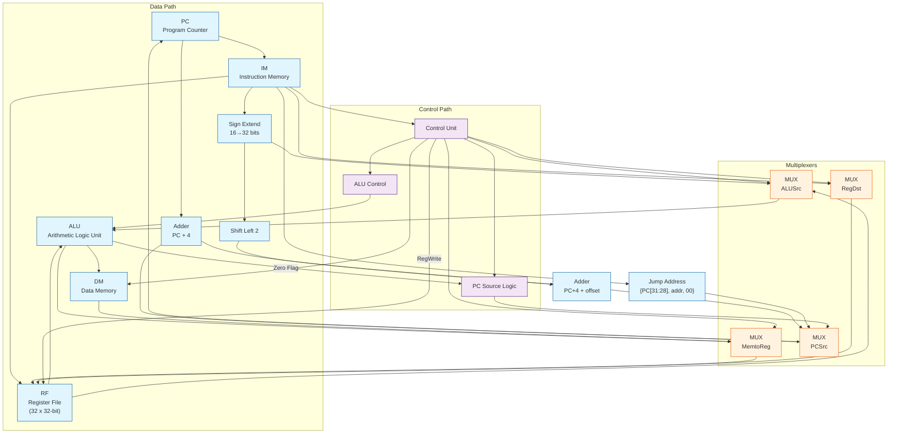
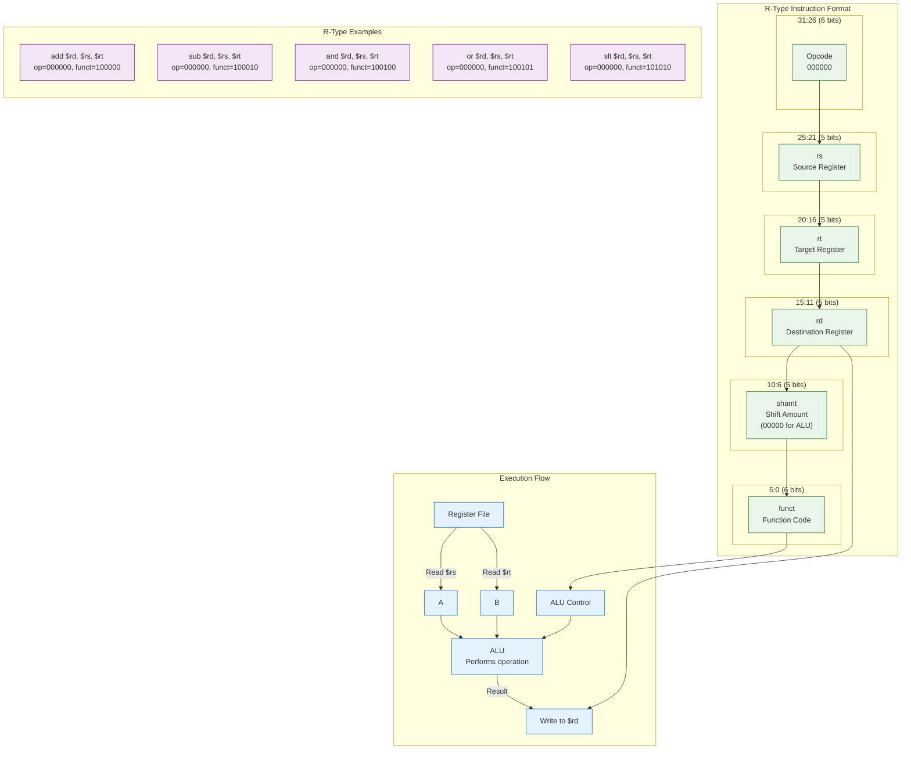

# Single-Cycle MIPS Processor

## Overview
This is a Verilog implementation of a single-cycle MIPS processor based on the design described in "Digital Design and Computer Architecture" by David Harris and Sarah Harris. The processor implements a subset of the MIPS instruction set architecture and executes one instruction per clock cycle.

## Features
- **32-bit architecture** with 32 general-purpose registers
- **Single-cycle execution**: Each instruction completes in one clock cycle
- **Supported instruction types**:
  - R-type: ADD, SUB, AND, OR, SLT
  - I-type: ADDI, ANDI, ORI, SLTI, LW, SW, BEQ, BNE
- **Memory-mapped I/O** support
- **Five-stage pipeline conceptually implemented in single cycle**:
  1. Instruction Fetch (IF)
  2. Instruction Decode (ID)
  3. Execute (EX)
  4. Memory Access (MEM)
  5. Write Back (WB)

## Block Diagram

## Implementation Details

### 1. Instruction Format Support

#### R-Type Instructions (Register)

#### I-Type Instructions (Immediate)
31-26 25-21 20-16 15-0
┌───────┬───────┬───────┬──────────────┐
│ op │ rs │ rt │ immediate │
└───────┴───────┴───────┴──────────────┘
6-bit 5-bit 5-bit 16-bit

### 2. Instruction Set

| Instruction | Format | Opcode | Funct | Operation |
|-------------|--------|--------|-------|-----------|
| ADD         | R      | 0x00   | 0x20  | rd = rs + rt |
| SUB         | R      | 0x00   | 0x22  | rd = rs - rt |
| AND         | R      | 0x00   | 0x24  | rd = rs & rt |
| OR          | R      | 0x00   | 0x25  | rd = rs \| rt |
| SLT         | R      | 0x00   | 0x2A  | rd = (rs < rt) ? 1 : 0 |
| ADDI        | I      | 0x08   | -     | rt = rs + imm |
| ANDI        | I      | 0x0C   | -     | rt = rs & imm |
| ORI         | I      | I      | 0x0D  | rt = rs \| imm |
| SLTI        | I      | 0x0A   | -     | rt = (rs < imm) ? 1 : 0 |
| LW          | I      | 0x23   | -     | rt = MEM[rs + imm] |
| SW          | I      | 0x2B   | -     | MEM[rs + imm] = rt |
| BEQ         | I      | 0x04   | -     | if (rs == rt) PC = PC + 4 + (imm << 2) |
| BNE         | I      | 0x05   | -     | if (rs != rt) PC = PC + 4 + (imm << 2) |
| J           | J      | 0x02   | -     | PC = {PC[31:28], address, 2'b00} |

### 3. Control Signals

| Signal | Width | Description |
|--------|-------|-------------|
| RegDst | 1-bit | Register destination (0=rt, 1=rd) |
| RegWrite | 1-bit | Register file write enable |
| ALUSrc | 1-bit | ALU source (0=rt, 1=immediate) |
| MemWrite | 1-bit | Data memory write enable |
| MemRead | 1-bit | Data memory read enable |
| MemtoReg | 1-bit | Write back source (0=ALU, 1=Memory) |
| Branch | 1-bit | Branch instruction |
| Jump | 1-bit | Jump instruction |
| ALUOp | 2-bit | ALU operation control |

### 4. ALU Operations

| ALU Control | Function |
|-------------|----------|
| 0000        | AND      |
| 0001        | OR       |
| 0010        | ADD      |
| 0110        | SUB      |
| 0111        | SLT      |
| 1100        | NOR      |
